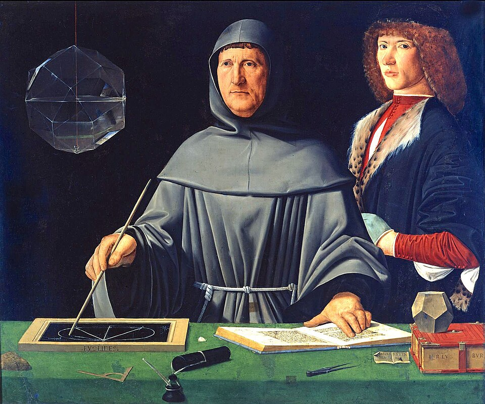

# Numerical Analysis



*"Portrait of Luca Pacioli" (1495) attributed to Jacopo de' Barbari — [Wikipedia](https://en.wikipedia.org/wiki/Portrait_of_Luca_Pacioli)*

Programming exercises covering the major topics in numerical analysis, developed for the "Numerical Analysis" course at EMAp/FGV (Escola de Matematica Aplicada, Fundacao Getulio Vargas).

## About

This repository contains ten problem sets and a final project, each implementing classical numerical methods in Python. The course followed the textbook *Numerical Mathematics and Computing* by Ward Cheney and David Kincaid, covering root-finding, interpolation, numerical integration, differential equations, and optimization.

**Professor:** Dr. Moacyr Alvim
**Semester:** 2018.2

## Topics and Methods

### Root-Finding and Linear Systems
- Jacobi iterative method
- Gaussian elimination
- Newton's method
- Bisection method

### Interpolation and Approximation
- Lagrange polynomial interpolation
- Cubic spline interpolation

### Numerical Differentiation and Integration
- Simpson's rule
- Romberg's method
- Richardson extrapolation
- Gaussian quadrature
- Monte Carlo integration

### Ordinary Differential Equations
- Euler's method
- Heun's method
- Runge-Kutta methods
- Crank-Nicolson method

### Optimization
- Gradient descent (final project)

## Tech Stack

- Python 3
- NumPy, Matplotlib

## Repository Structure

```
lista-1/    # Jacobi method, Gaussian elimination
lista-2/    # Bisection method, Newton's method
lista-3/    # Polynomial interpolation (Lagrange)
lista-4/    # Cubic splines
lista-5/    # Numerical differentiation and approximation
lista-6/    # Euler's method, Heun's method
lista-7/    # Runge-Kutta methods
lista-8/    # Simpson's rule, numerical integration
lista-9/    # Romberg's method, Gaussian quadrature, Monte Carlo
lista-10/   # Crank-Nicolson method
project/    # Gradient descent implementation
```

## How to Run

Each problem set directory contains standalone Python scripts. For example:

```bash
python lista-1/1-jacobi.py
python lista-2/delfino-2-newton.py
python project/desc-grad.py
```
